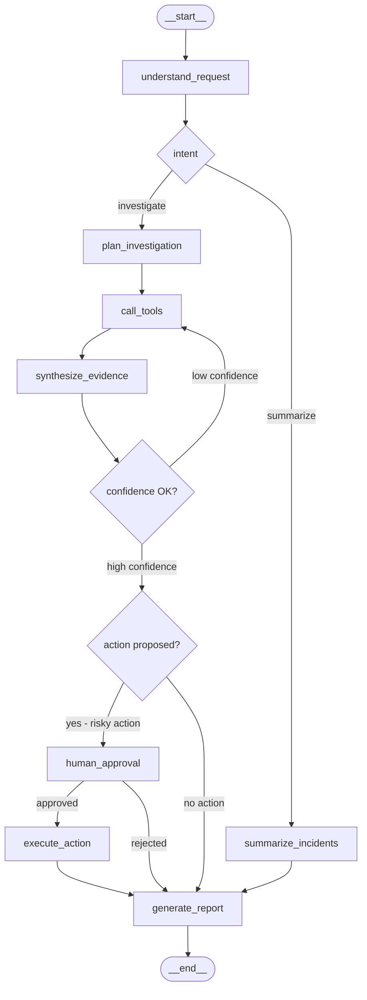

# Incident Investigation Copilot — Concrete Project Plan

## Overview

This project builds a production-grade agentic AI system that investigates ML infrastructure and service incidents by orchestrating multiple tools through direct calls and MCP, gating risky actions behind a human-in-the-loop approval step, and evaluating performance against a synthetic incident corpus in LangSmith. It is a natural progression from the Recruiter Copilot: same LangGraph + LangSmith + Docker + Ollama + PGVector stack, significantly higher complexity in tool orchestration and deployment realism.[1][2][3][4][5]

The agent handles questions like:
- "Why did the nightly feature pipeline fail last night?"
- "Latency on the recommendations service spiked at 02:00 — what changed?"
- "Compare the last two training runs and tell me what degraded."
- "Summarize all incidents in the last 7 days and flag recurring patterns."

***

## Architecture

The graph is built with LangGraph `StateGraph`, a Redis-backed checkpointer for HITL persistence, and MCP tools wired in via `langchain-mcp-adapters`. The typed state carries intent, investigation plan, accumulated tool results, graded evidence, a proposed action, approval status, and the final report across all nodes.[6][7][1]

### Graph flow



### State schema

Key fields:

| Field | Type | Purpose |
|---|---|---|
| `user_request` | `str` | Raw user input |
| `intent` | `str` | classify / investigate / compare / summarize |
| `investigation_plan` | `list[str]` | Ordered tool-call sequence |
| `tool_results` | `list[dict]` | Accumulated raw tool outputs |
| `evidence` | `list[dict]` | Filtered, graded evidence pieces |
| `proposed_action` | `dict \| None` | Remediation proposed by the agent |
| `approval_status` | `str \| None` | pending / approved / rejected |
| `confidence` | `float` | Evidence quality score (0–1) |
| `retry_count` | `int` | Re-investigation cycles |
| `final_report` | `str` | Formatted markdown answer |

***

## Tool Stack

### Direct tools (fast path)

These are plain Python functions registered as LangGraph tools. No MCP overhead — the agent calls them directly for the inner loop.[8][9]

| Tool | What it does |
|---|---|
| `query_incident_logs` | Structured log search by service, time window, error level — reads from Postgres |
| `get_metrics_window` | Latency, error rate, throughput for a service + time range — reads time-series table |
| `list_deployments` | Recent deployments with service, commit SHA, timestamp |
| `get_training_run` | ML training run metadata: metrics, config, loss curves — MLflow-like schema |
| `search_runbooks` | Semantic search over runbook markdown docs via PGVector — same pattern as Recruiter Copilot |
| `propose_remediation` | Draft a human-readable fix suggestion (no execution, no side effects) |

### MCP-backed tools (standardized layer)

Wire these via `MultiServerMCPClient` from `langchain-mcp-adapters` using `load_mcp_tools()`. Each MCP client maintains a 1:1 connection with its server over stdio or SSE transport.[7][1][6]

| MCP Server | Tools exposed | Source |
|---|---|---|
| `filesystem` | Read runbooks, config files, deployment manifests | Official MCP servers repo |
| `postgres` | Raw SQL over incident/deployment/metrics DB | Official MCP servers repo |
| `github` | Fetch recent commits, PRs, diffs for a service | Official MCP servers repo |
| Custom `ml-ops-mcp` | `get_training_run`, `compare_runs`, `get_pipeline_dag` | Build with FastMCP |

Use **stdio** transport for the custom server (local dev). Switch to **SSE/streamable HTTP** for remote or containerized scenarios.[10][6]

### Human-in-the-loop gate

Apply LangGraph's `interrupt()` function before any `execute_action` node — rollback, re-trigger, Slack alert. The graph pauses, marks the thread as `interrupted`, and persists context in the checkpointer. Resume with `graph.invoke(Command(resume=...))` from the UI or API. This is the production-correct HITL pattern — unlike `input()`, it survives restarts and works across machines.[11][12][4]

***

## Dataset Strategy: Synthetic Is the Right Choice

### Why not real data

Real incident logs contain PII, internal hostnames, and proprietary system topology. They are also rarely labeled with verified root causes. Synthetic data lets you control incident type distribution, guarantee ground truth for evaluation, create adversarial examples with red herrings, and iterate freely.[13][14][15]

Industry practice confirms this: synthetic data accelerates agent debugging and evaluation coverage, especially for rare and edge-case scenarios that real data underrepresents.[16][15][13]

### Seed from real open-source logs

Do not generate from scratch — use real log structures as a template:

| Dataset | What it provides |
|---|---|
| **Loghub** (logpai/loghub) | 30+ labeled system log collections: HDFS, Spark, BGL, OpenStack[17] |
| **Rootly logs-dataset** | Real production access + error logs from SRE environments[18] |
| **Splunk attack_data** | Curated event logs across failure and attack scenarios[19] |

Take 3–5 real log templates per failure category. Use them as seeds for LLM-augmented generation rather than copying verbatim.

### Synthetic generation pipeline

Build this as a standalone script in your `db_prep/` folder, mirroring the Recruiter Copilot pattern:

```
Step 1: Define incident schema
  - incident_id, service, start_time, duration, root_cause_label, severity
  - linked log_ids, metric_anomaly_windows, deployment_ids

Step 2: Seed with real log patterns from Loghub
  - Use 3-5 real log templates per category (OOM, timeout, data issue, model drift)

Step 3: LLM-augmented generation per incident
  - 50–200 realistic log lines with noise + irrelevant entries
  - Correlated metrics time series — inject spike/drop at incident start_time
  - Matching or absent deployment event (absent = red herring)
  - Runbook entry for the root cause type

Step 4: Build ground truth labels
  - root_cause: str (OOM | timeout | model_drift | bad_deployment | data_skew)
  - evidence_ids: list[str] — which logs/metrics/deployments are actually relevant
  - expected_tools: list[str] — tools the agent should call to reach the answer
  - expected_report_keywords: list[str] — must appear in the final report

Step 5: Persist to Postgres + JSON
  - incidents, logs, metrics, deployments tables
  - runbooks as markdown files indexed in PGVector
```

**Target corpus: 200–500 synthetic incidents** across 5–6 root cause categories, with easy (single cause), medium (two correlated causes), and hard (multiple correlated causes + red herrings) difficulty tiers.[14][15]

### Evaluation examples for LangSmith

For each incident, create a LangSmith dataset example:[20][3]
- **Input**: natural language question about the incident
- **Expected output**: root cause label + evidence reference IDs
- **Evaluators**: root cause accuracy, evidence recall, tool selection precision, hallucination rate

LangSmith now supports synthetic dataset augmentation directly from the UI. Use it to expand your hand-crafted seed examples. Run offline evals with the same LLM judge + Ollama pattern from the Recruiter Copilot evaluation setup.[21][3][20]

***

## 2-Week Build Plan

### Week 1 — Foundation, data, and direct tools

| Day | Task |
|---|---|
| 1 | Define state schema, project structure, `langgraph.json`, Docker Compose skeleton |
| 2 | Build `db_prep/generate_incidents.py` — synthetic incident + log + metrics + deployment generator |
| 3 | Build direct tools: `query_incident_logs`, `get_metrics_window`, `list_deployments` |
| 4 | Build `understand_request` + `plan_investigation` nodes, basic graph skeleton |
| 5 | Build `call_tools` node with tool router, `synthesize_evidence` node with confidence scoring |
| 6 | Build `generate_report` node — structured markdown output with cited evidence |
| 7 | First end-to-end run via `langgraph dev`, upload 20 examples to LangSmith eval dataset |

### Week 2 — MCP, HITL, evals, and deployment

| Day | Task |
|---|---|
| 8 | Wire `langchain-mcp-adapters` — `MultiServerMCPClient` with filesystem + postgres MCP servers |
| 9 | Build custom `ml-ops-mcp` server with FastMCP: `get_training_run`, `compare_runs`, `get_pipeline_dag` |
| 10 | Add `human_approval` node with `interrupt()` + Redis checkpointer in Docker Compose |
| 11 | Add `search_runbooks` tool backed by PGVector — reuse `retrieval.py` pattern from Recruiter Copilot |
| 12 | Build LLM judge evaluator: root cause, tool selection, hallucination, evidence recall |
| 13 | Full Docker Compose: agent + Postgres/PGVector + Redis + Ollama — run smoke tests |
| 14 | Full eval run on 50-incident dataset, fix regressions, write README |

***

## Project Structure

```text
incident-copilot/
├── langgraph.json
├── docker-compose.yml
├── .env
├── requirements.txt
├── README.md
├── db_prep/
│   ├── generate_incidents.py       # Synthetic data pipeline
│   ├── seed_logs.py                # Real log templates from Loghub
│   ├── index_runbooks.py           # PGVector indexing for runbooks
│   └── runbooks/                   # Markdown runbooks by root cause
├── src/
│   └── incident_copilot/
│       ├── graph.py
│       ├── state.py
│       ├── tools/
│       │   ├── logs.py
│       │   ├── metrics.py
│       │   ├── deployments.py
│       │   ├── runbooks.py
│       │   └── mcp_tools.py        # MultiServerMCPClient setup
│       ├── nodes/
│       │   ├── understand.py
│       │   ├── plan.py
│       │   ├── call_tools.py
│       │   ├── synthesize.py
│       │   ├── approval.py         # interrupt() gate
│       │   ├── execute_action.py
│       │   └── report.py
│       ├── mcp_servers/
│       │   └── ml_ops_server.py    # Custom FastMCP server
│       └── prompts/
└── tests/
    ├── data/
    │   └── incident_eval_dataset.json
    ├── llm_judge.py
    ├── test_graph_smoke.py
    ├── test_tools_smoke.py
    └── test_eval_preproduction.py
```

***

## Key Technical Decisions

### Checkpointer: Redis for production HITL

`interrupt()` requires a persistent checkpointer so interrupted threads survive restarts. Use `langgraph-checkpoint-redis` in Docker Compose. This also enables time-travel debugging: rewind the graph to any past state to diagnose where reasoning went wrong.[12][4][1]

### Confidence scoring + re-investigation loop

After `synthesize_evidence`, score confidence based on: number of corroborating pieces, agreement between tool outputs, and presence of a matching runbook. If below threshold and `retry_count < max_retries`, loop back to `call_tools` with a refined plan. This mirrors the hallucination retry loop in the Recruiter Copilot but applied to evidence quality.[1][8]

### MCP transport choice

Use **stdio** for the custom `ml-ops-mcp` server during local development — simplest, no network config. Use **SSE** (Streamable HTTP) for production or when the MCP server runs in a separate container. `MultiServerMCPClient` supports mixing transport types per server in a single config.[6][10][7]

### Model allocation

Keep the same Ollama split as Recruiter Copilot: `gemma3:1b` for intent classification and plan validation (fast, low cost), `gemma3:4b` for evidence synthesis and report generation, `qwen3-embedding:8b` for runbook semantic search. This validates that your tooling choices generalize across domains.

***

## Evaluation Targets

| Metric | How measured | Target |
|---|---|---|
| Root cause accuracy | Exact match vs. ground truth label | > 75% on easy incidents |
| Evidence recall | % of ground-truth evidence IDs cited in report | > 60% |
| Tool selection precision | % of tool calls in `expected_tools` | > 70% |
| Hallucination rate | LLM judge: evidence cited but not in retrieved context | < 10% |
| HITL trigger rate | % of incidents where approval gate fires correctly | Calibrate to severity threshold |
| Latency P50 | Trace timing from LangSmith | Establish baseline for regression |

***

## Portfolio Value

This project demonstrates in one system: dynamic multi-tool reasoning, MCP integration (existing + custom server), production HITL with `interrupt()` and Redis persistence, synthetic dataset engineering as a standalone skill, LangSmith offline + replay evals with LLM judge, and Docker Compose deployment across multiple backing services. The ML infrastructure domain connects directly to your Azure ML and MLOps background, making the project both technically credible and personally motivated.[3][4][5][14][1]