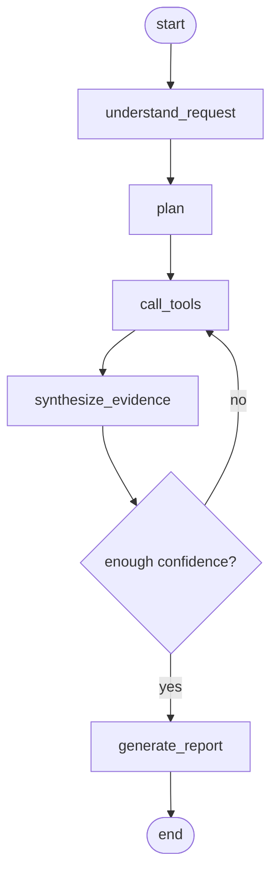

# I want to do this project step by step to understand the MCP and a project for my resume.

so i want to start with local tools then add some plugin tolls with api calss and then mcp for tools. so give me a structure to impelment it step by step by following it based on what we discussed

Yes — that is the **right learning path** for you: build the same project in layers so you understand tool calling first, then API-backed tools, then MCP as the standard interface layer. The key idea is to keep the **business problem fixed** while changing only the tool integration style, so your resume can clearly show progression from local agent to production-style MCP-enabled agent.[^1][^2][^3][^4][^5][^6]

## Roadmap

Use one project name the whole way: **Incident Investigation Copilot**. Build it in four phases:


| Phase | Goal | What you learn |
| :-- | :-- | :-- |
| 0 | Data + baseline graph | LangGraph flow, state, eval loop |
| 1 | Local tools | Plain tool calling, routing, retries |
| 2 | API/plugin tools | Tool wrappers over external service boundaries |
| 3 | MCP tools | MCP client/server model, standardization, transport |
| 4 | Production hardening | HITL, evals, Docker, tracing |

This structure is strong for a resume because each phase adds one real architectural skill instead of mixing everything at once.[^7][^6]

## Build order

Start with a narrow use case: **investigate ML/data pipeline incidents** such as failed nightly jobs, latency spikes, data drift, or bad deployments. Keep the graph stable across all phases:[^6]



In later phases, you do **not** redesign the project; you only change how `call_tools` gets its capabilities.[^1][^5]

## Phase 0

First build the **baseline without MCP** and without external APIs. Your goal is to get one end-to-end graph working with a synthetic dataset and deterministic local tools.[^2]

### What to implement

- `state.py` with fields like `user_query`, `intent`, `plan`, `tool_results`, `evidence`, `confidence`, `final_answer`.
- `graph.py` with nodes:
    - `understand_request`
    - `plan_investigation`
    - `call_tools`
    - `synthesize_evidence`
    - `generate_report`
- `tests/` with smoke tests and a small eval dataset.
- `db_prep/` with synthetic incident generation.


### Dataset first

Yes, use a **synthetic dataset** first, but seed it from real log shapes and patterns rather than inventing random text. This gives you realistic structure and full ground truth for evaluation, which is much better for agent debugging than unlabeled real logs.[^8][^9][^10]

### Suggested synthetic schema

- `incidents.csv/json`
- `logs.csv`
- `metrics.csv`
- `deployments.csv`
- `runbooks/` markdown files

Each incident should include:

- `incident_id`
- `service`
- `severity`
- `root_cause`
- `time_window`
- `relevant_log_ids`
- `relevant_metric_windows`
- `expected_tools`
- `expected_answer_keywords`
# Phase 0 Dataset: HDFS_v1

## What It Is

**HDFS_v1** (Hadoop Distributed File System logs) is a real-world benchmark log dataset collected from a distributed storage cluster. It contains ~11 million raw log lines emitted by HDFS during a workload run, where every read, write, replication, and failure event is recorded. Each log line is tagged with a **block ID** — the unique identifier of the data chunk being operated on.

The dataset is part of the [Loghub collection](https://github.com/logpai/loghub) maintained by LogPAI, and is one of the most widely used benchmarks in AIOps and log anomaly detection research.

---

## Mental Model

HDFS splits every stored file into **blocks**. Each block gets a unique ID (e.g. `blk_-1608999687919862906`). Every operation touching that block — replication, read, write, IOException — emits a log line tagged with that block ID.

The dataset groups all log lines per block ID into a **trace** (the block's full event timeline), then labels each trace as `Normal` or `Anomaly`. One trace = one incident.

---

## Key Files

| File | Contents | Use in Phase 0 |
|---|---|---|
| `HDFS.log` | Raw log lines: `date time pid level component message` | Skip — too large (11M lines) |
| `anomaly_label.csv` | `BlockId`, `Label` (Normal / Anomaly) | Ground truth → maps to `root_cause` |
| `Event_traces.csv` | Block ID + sequence of event IDs per trace | Your `incidents.csv` — one row per incident |
| `HDFS_templates.csv` | Event ID → human-readable log template string | Translates event sequences into readable descriptions |
| `Event_occurrence_matrix.csv` | Block ID × event count feature matrix | Skip for Phase 0 (ML feature engineering) |

---

## Concrete Example

`Event_traces.csv` entry:
```
blk_-1608999687919862906  →  [E5, E22, E11, E9, E11, E9, E26]
```

`anomaly_label.csv` says:
```
blk_-1608999687919862906, Anomaly
```

`HDFS_templates.csv` tells you E26 means:
> *"Received exception while serving blk_ from ...: java.io.IOException"*

**Result:** this block had a replication sequence that ended in an IOException → labeled Anomaly → one complete incident with a full log trail and ground truth.

---

## Why It Fits Phase 0

- **No labeling work** — ground truth is already provided
- **Structured format** — `Event_traces.csv` is already one-row-per-incident, ready to load
- **Easy to subset** — take 50–100 anomalous + 50 normal traces; no need to process all 11M lines
- **Clear eval loop** — agent investigates a block trace → claims a root cause → compare against `anomaly_label.csv` → pass/fail score

> **Gap to fill synthetically:** HDFS has no `metrics.csv` or `deployments.csv`. Generate these with a short Python script in `db_prep/` as described in the implementation plan.

---

## Download

```bash
# From Loghub GitHub
https://github.com/logpai/loghub  # → HDFS section

# Or directly via Zenodo (citable)
https://zenodo.org/records/8196385
```

## Phase 1

Now add **local tools only**. These are just Python functions the graph can call directly.[^2]

### Tools to build

- `query_logs(service, time_range, severity)`
- `get_metrics(service, time_range)`
- `list_deployments(service, time_range)`
- `read_runbook(root_cause_or_service)`
- `compare_training_runs(run_a, run_b)` if you want ML flavor


### Folder structure

```text
incident-copilot/
├── src/
│   └── incident_copilot/
│       ├── graph.py
│       ├── state.py
│       ├── nodes/
│       │   ├── understand.py
│       │   ├── plan.py
│       │   ├── call_tools.py
│       │   ├── synthesize.py
│       │   └── report.py
│       ├── tools/
│       │   ├── logs.py
│       │   ├── metrics.py
│       │   ├── deployments.py
│       │   └── runbooks.py
│       └── prompts/
├── db_prep/
├── tests/
└── langgraph.json
```


### What to learn here

- How the LLM chooses tools.
- How tool descriptions affect routing.
- How to grade tool results.
- How to retry when evidence is weak.

Do not move to APIs until this phase is stable.[^2]

## Phase 2

Next, keep the same tools but move some behind **API/plugin-style wrappers**. This teaches you that a tool is really an interface over a capability, whether local or remote.[^11][^1]

### What changes

Instead of `query_logs()` reading local files directly, make it call:

- a small FastAPI service for logs
- a small FastAPI service for metrics
- maybe one external safe API like weather or news only for learning tool wrapping, not as part of the main product


### Why this phase matters

You learn:

- request/response boundaries
- auth/env management
- retries/timeouts
- API schema normalization
- how agents behave when tools fail or return partial results


### Suggested structure

```text
incident-copilot/
├── services/
│   ├── logs_api/
│   ├── metrics_api/
│   └── deployments_api/
├── src/incident_copilot/tools/
│   ├── logs_api_tool.py
│   ├── metrics_api_tool.py
│   └── deployments_api_tool.py
```

At this stage your graph still calls LangChain/LangGraph tools, but those tools call APIs internally.[^1]

## Phase 3

Now introduce **MCP**. This is where you keep the agent logic the same but replace some direct/API tools with MCP-exposed tools discovered through an MCP client.[^4][^12][^13][^6]

### Core MCP concepts to learn

- **Server** exposes tools, resources, and prompts.[^12][^14][^4]
- **Client** connects to one or more MCP servers and loads capabilities.[^13][^6]
- **Tools** are callable actions.[^12]
- **Resources** are readable context objects, often better than tools for passive data.[^14]
- **Transport** is usually `stdio` locally and networked transport later.[^6]


### Best step-by-step MCP path

1. Keep your local Python logic.
2. Wrap one stable tool as a **custom MCP server**.
3. Load it into LangGraph using `langchain-mcp-adapters`.[^15][^5]
4. Replace only one tool first, such as `read_runbook` or `query_logs`.
5. Then add a second MCP server, such as filesystem or postgres.[^16][^3][^15]

### What to MCP-wrap first

Best first custom MCP tools:

- `query_incident_logs`
- `get_metrics_window`
- `get_pipeline_run`
- `compare_training_runs`

Best existing MCP servers later:

- filesystem
- postgres
- github

That matches what we discussed before: use existing MCP servers for generic capabilities, and build your own MCP server for domain logic.[^3][^16]

## Phase 4

Finally add **production-style controls**. This is what makes the project resume-worthy beyond a prototype.[^7]

### Add these last

- LangSmith traces and eval datasets.[^10]
- Human-in-the-loop approval using `interrupt()` for risky actions.[^17][^7]
- Docker Compose for agent + DB + Redis + APIs + Ollama.
- Replay testing on synthetic incidents.
- LLM judge for root cause quality and hallucination.
- Optional action node like “draft remediation” but not auto-execute.

This phase proves you can move from demo to realistic system design.[^17][^7]

## Recommended implementation sequence

Follow this exact sequence:

1. Generate synthetic incident dataset.
2. Build baseline graph with no tools.
3. Add local file/database tools.
4. Add evaluation dataset and smoke tests.
5. Wrap 2–3 tools behind local FastAPI services.
6. Add timeouts, retries, and structured error handling.
7. Convert one internal tool into a custom MCP server.
8. Connect with `MultiServerMCPClient` and `load_mcp_tools()`.[^15][^13]
9. Add one existing MCP server like filesystem or postgres.[^16][^15]
10. Add HITL with `interrupt()`.[^7][^17]
11. Dockerize the whole stack.
12. Run LangSmith evals and collect screenshots/traces for your resume.[^10]

## Resume framing

Frame the final project as one evolving system, not three separate toys. A strong bullet would be:

- Built an Incident Investigation Copilot with LangGraph, progressing from local tool calling to API-backed tools and MCP-integrated tools, with synthetic evaluation data, LangSmith tracing, and human-in-the-loop approval for production-style incident analysis.[^5][^7]

A second bullet could be:

- Designed a custom MCP server for domain-specific operational tools and integrated existing MCP servers for generic capabilities such as filesystem and database access, improving tool portability and standardization across the agent stack.[^3][^4][^12]


## Starter repo layout

```text
incident-copilot/
├── README.md
├── langgraph.json
├── requirements.txt
├── docker-compose.yml
├── .env.example
├── db_prep/
│   ├── generate_incidents.py
│   ├── seed_templates.py
│   └── runbooks/
├── services/
│   ├── logs_api/
│   ├── metrics_api/
│   └── deployments_api/
├── src/
│   └── incident_copilot/
│       ├── graph.py
│       ├── state.py
│       ├── retrieval.py
│       ├── nodes/
│       ├── tools/
│       ├── mcp_servers/
│       ├── mcp_clients/
│       └── prompts/
└── tests/
    ├── data/
    ├── test_graph_smoke.py
    ├── test_tools_smoke.py
    └── test_eval_preproduction.py
```


## First milestone

Your **first milestone** should be: “a LangGraph agent that investigates one synthetic incident using only local tools and produces a grounded report.” Do not start with MCP first, because MCP will make much more sense once you already feel the pain of managing tools manually.[^11][^1][^6][^2]

Next I can give you the **exact Phase 0 and Phase 1 file-by-file implementation plan**, including which files to create first and what each file should contain.
<span style="display:none">[^18][^19][^20][^21][^22][^23][^24]</span>

<div align="center">⁂</div>

[^1]: https://www.perplexity.ai/search/01a41748-30e8-4c40-8505-961923998484

[^2]: https://www.perplexity.ai/search/983ddad6-b97d-43d7-8c21-e903178278c4

[^3]: https://www.perplexity.ai/search/09d84071-27fd-430a-84b4-b2c0f3ab5148

[^4]: https://modelcontextprotocol.io/docs/getting-started/intro

[^5]: https://reference.langchain.com/python/langchain-mcp-adapters

[^6]: https://cloud.google.com/discover/what-is-model-context-protocol

[^7]: https://docs.langchain.com/oss/python/langchain/human-in-the-loop

[^8]: https://github.com/Rootly-AI-Labs/logs-dataset

[^9]: https://github.com/logpai/loghub

[^10]: https://www.langchain.com/langsmith/evaluation

[^11]: https://www.perplexity.ai/search/ccf2d2b5-705f-4f35-b232-3b36b3b5909c

[^12]: https://modelcontextprotocol.io/specification/2025-06-18/server/tools

[^13]: https://reference.langchain.com/python/langchain-mcp-adapters/client

[^14]: https://modelcontextprotocol.info/docs/concepts/resources/

[^15]: https://blog.box.com/using-existing-mcp-server-langchain-mcp-adapters

[^16]: https://www.perplexity.ai/search/23489e1f-0a4f-4ea7-92c8-bc307b82844c

[^17]: https://www.langchain.com/blog/making-it-easier-to-build-human-in-the-loop-agents-with-interrupt

[^18]: https://github.com/modelcontextprotocol

[^19]: https://modelcontextprotocol.io/specification/2025-11-25/server/tools

[^20]: https://github.com/KirtiJha/langgraph-interrupt-workflow-template

[^21]: https://www.youtube.com/watch?v=TTtQxUprbDY

[^22]: https://www.youtube.com/watch?v=-8DVauf5iu4

[^23]: https://www.nkthanh.dev/en/posts/human-in-loop-with-langchain

[^24]: https://www.anthropic.com/news/model-context-protocol
