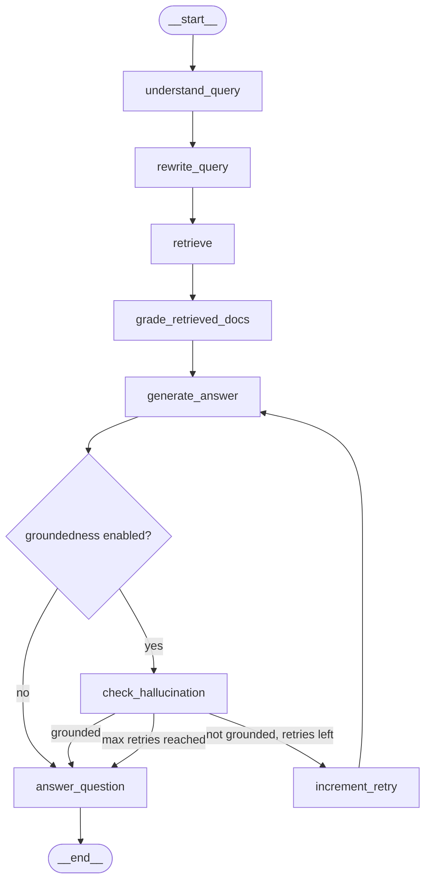

# Recruiter Copilot

A production-oriented RAG system for querying and analyzing a pool of 10,498 resumes with LangGraph, PGVector, and local Ollama models. It supports recruiter workflows such as candidate search, profile deep-dives, and grounded comparisons, and is designed to be run and inspected through `langgraph dev` with LangSmith tracing enabled.[file:3]

## Overview

The system processes recruiter queries through a graph-based workflow: understand the request, optimize it for retrieval, fetch relevant resume evidence, grade retrieved documents, generate an answer, and optionally verify groundedness before returning the final response.[file:3]

Typical use cases:
- Find candidates matching skills, experience, or role constraints.
- Review a specific candidate in more detail using candidate identifiers or retrieved context.
- Compare shortlisted candidates for a target role.
- Return evidence-grounded answers with retry logic when support is weak.

## Architecture

The application is built with LangGraph `StateGraph` and a shared typed state that carries query understanding, retrieval outputs, candidate scoring, evidence, generation results, and groundedness metadata across the graph.

### Graph flow



### Nodes

- `understand_query` — extracts intent, response mode, filters, candidate IDs, and requested result count from the user query.
- `rewrite_query` — improves the query for semantic retrieval when rewrite is enabled.
- `retrieve` — searches the PGVector-backed resume index and returns relevant chunks.
- `grade_retrieved_docs` — scores and filters retrieved documents before answer generation.
- `generate_answer` — creates the recruiter-facing answer from candidate evidence.
- `check_hallucination` — verifies whether the generated answer is supported by retrieved evidence.
- `increment_retry` — increments retry count before another generation attempt.
- `answer_question` — returns the final response to the caller.

## Project structure

```text
.
├── langgraph.json
├── notebooks/
│   └── experiments.ipynb
├── README.md
├── requirements.txt
├── src/
│   └── recruiter_copilot/
│       ├── graph.py
│       ├── state.py
│       ├── retrieval.py
│       ├── nodes/
│       │   ├── understand.py
│       │   ├── rewrite.py
│       │   ├── retrieve.py
│       │   ├── grade.py
│       │   ├── generate.py
│       │   ├── grounding.py
│       │   └── routing.py
│       └── prompts/
└── tests/
    ├── data/
    │   └── recruiter_copilot_eval_dataset.json
    ├── llm_judge.py
    ├── test_eval_preproduction.py
    ├── test_graph_smoke.py
    ├── test_pgvector_smoke.py
    └── upload_eval_dataset.py
```

The repository also includes smoke tests for graph execution and PGVector integration, plus a pre-production evaluation workflow with an eval dataset and LLM judge utilities.[file:3]

## Configuration

The system is configured through environment variables for tracing, database connectivity, model selection, and runtime behavior. The current setup uses LangSmith tracing, Postgres + PGVector, `qwen3-embedding:8b` for embeddings, `gemma3:1b` as the fast model, and `gemma3:4b` as the generation model.[file:3]

Key settings:
- `LANGSMITH_TRACING` — enables LangSmith tracing.
- `LANGSMITH_PROJECT` — LangSmith project name.
- `LANGSMITH_ENDPOINT` — LangSmith endpoint.
- `POSTGRES_CONNECTION` — Postgres connection string.
- `PGVECTOR_COLLECTION_NAME` — vector collection name.
- `EMBEDDING_MODEL` — embedding model used for indexing and retrieval.
- `FAST_LLM_MODEL` — lightweight model for query understanding, grading, and checks.
- `GENERATION_LLM_MODEL` — answer generation model.
- `TOP_K` — retrieval depth before grading.
- `MAX_RETRIES` — maximum groundedness retry attempts.
- `ENABLE_GROUNDEDNESS_CHECK` — toggles groundedness verification.
- `ENABLE_QUERY_REWRITE` — toggles semantic query rewriting.

## Run with LangGraph

This project is intended to be developed, tested, and inspected through LangGraph development tooling and LangSmith traces.[file:3]

1. Create a `.env` file with LangSmith, Postgres, PGVector, and model settings.
2. Install dependencies:
   ```bash
   pip install -r requirements.txt
   ```
3. Make sure Postgres with PGVector is running and the required Ollama models are available locally.
4. Start the application:
   ```bash
   langgraph dev
   ```
5. Open the LangGraph development UI, run the graph defined in `langgraph.json`, and inspect traces in LangSmith.[file:3]

## Testing

Run the core validation suite with:

```bash
pytest tests/test_graph_smoke.py
pytest tests/test_pgvector_smoke.py
pytest tests/test_eval_preproduction.py
```

These tests cover graph execution, vector store connectivity, and pre-production evaluation behavior.[file:3]

## Tech stack

| Component | Choice |
|---|---|
| Orchestration | LangGraph |
| Tracing / observability | LangSmith |
| LLM runtime | Ollama |
| Fast model | `gemma3:1b` |
| Generation model | `gemma3:4b` |
| Embeddings | `qwen3-embedding:8b` |
| Vector store | Postgres + PGVector |

## Notes

The workflow supports structured filters, candidate targeting, retrieval grading, evidence-based answer generation, and retry-based groundedness checking. This makes it more controllable and recruiter-oriented than a basic retrieve-and-generate pipeline.