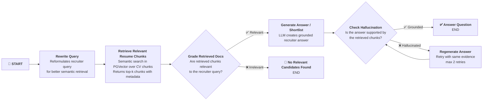

# Recruiter Copilot
Built a production-oriented recruiter copilot over 10,000 resumes with hybrid retrieval, reranking, LangGraph orchestration, LangSmith-based evaluation, and auditable shortlist generation with human review controls.

## Graph / Agent Flow — Baseline

## What to build  
The project should have these production-grade layers:
**Ingestion pipeline:** parse CVs, normalize structured fields, detect parsing errors, chunk documents intelligently, create embeddings, and attach metadata such as role, seniority, location, language, skills, and years of experience.
**Retrieval stack:** vector search, BM25 or keyword search, metadata filtering, then reranking to produce a top candidate set.
**Copilot layer:** LangGraph workflow for query understanding, retrieval, evidence aggregation, candidate comparison, shortlist drafting, and fallback behavior when evidence is weak.
**Evaluation layer:** golden datasets, retrieval evals, answer quality evals, failure slicing, trace review, and regression testing in LangSmith.
**Safety and compliance layer:** human-in-the-loop approval, explainable outputs, logging, and candidate-facing transparency assumptions documented clearly.