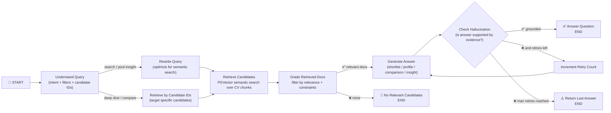

# Recruiter Copilot

A recruiter copilot over a large resume pool built with LangGraph, PGVector, and local Ollama models. It helps answer recruiter-style questions like:

- “Give me candidates with 5+ years in data science and NLP/LLM.”
- “Tell me more about this specific candidate.”
- “Compare these two profiles for a senior role.”

---

## What it does

- Understands recruiter intent (search, deep-dive, compare, pool insight).
- Retrieves relevant resume chunks from a Postgres + PGVector store.
- Grades and filters candidates using structured constraints (skills, years, location).
- Generates grounded answers (shortlists, profiles, comparisons).
- Checks for hallucinations before returning a final answer.[file:3][file:13][file:14]

---

## Graph / Agent Flow



---

## Tech stack

- **Orchestration**: LangGraph (Python)  
- **LLMs (Ollama)**:  
  - Fast model (classification, grading, checks): `gemma3:1b`  
  - Generation model (answers): `phi4-mini:latest`  
  - Embeddings: `qwen3-embedding:8b`  
- **Vector store**: Postgres + PGVector (`langchain-postgres`)  
- **Tracing / eval**: LangSmith (optional but wired in).[file:2][file:3]

---

## How to run

1. Create a `.env` with:

   - LangSmith keys (optional)
   - Postgres connection string
   - `PGVECTOR_COLLECTION_NAME`
   - `FAST_LLM_MODEL`, `GENERATION_LLM_MODEL`, `EMBEDDING_MODEL`
   - `TOP_K`, `MAX_RETRIES`, `ENABLE_GROUNDEDNESS_CHECK`

2. Install dependencies:

   ```bash
   pip install -r requirements.txt
   ```

3. Start your Ollama models and Postgres instance.

4. Invoke the graph (from `langgraph.json`):

   ```json
   {
     "graphs": {
       "recruiter_copilot": "./src/recruiter_copilot/graph.py:graph"
     },
     "env": ".env"
   }
   ```

   Then call it with a state like:

   ```python
   graph.invoke({"user_query": "give me top 5 candidates with 5+ years in data science and NLP"})
   ```

---

## Next ideas

- UI for recruiters (chat + clickable shortlists).
- Rich candidate comparison mode.
- Pool insights (skill distributions, location breakdowns) via metadata and aggregation.[file:3]
